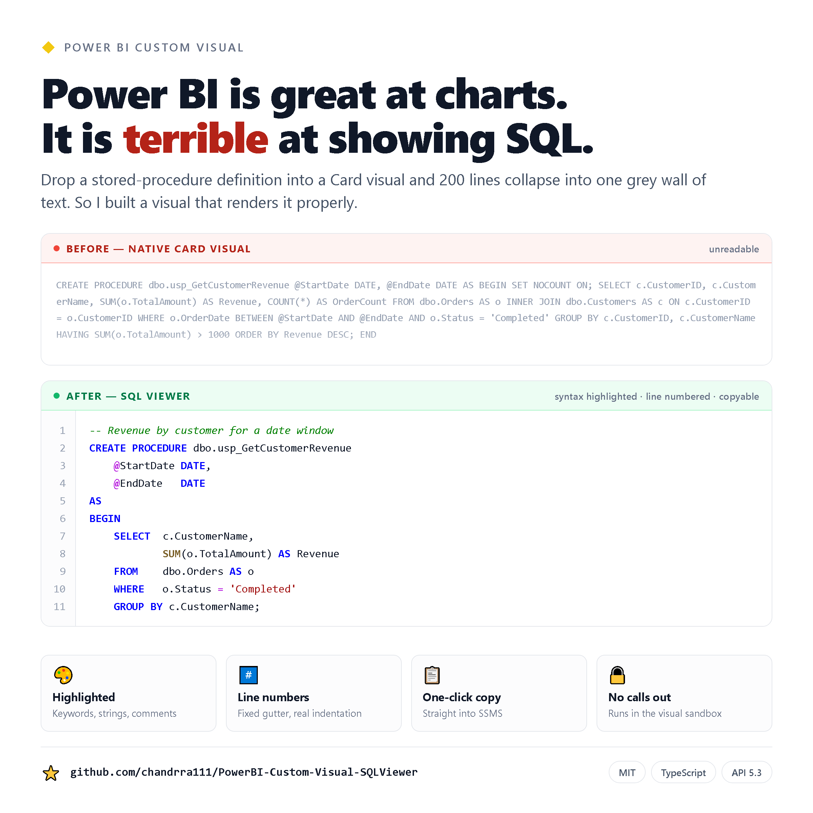

# SQL Viewer — Power BI Custom Visual

A Power BI custom visual that renders SQL text (stored procedure bodies, view
definitions, ad-hoc queries) as **re-indented, syntax-highlighted, line-numbered code**
directly inside a report page — instead of the unreadable single-line blob you
get from a Card or Table visual.

Built with the Power BI Visuals API 5.3 and [Prism.js](https://prismjs.com/).

## Why

Data dictionaries and lineage reports often store SQL definitions in a column
(e.g. from `sys.sql_modules.definition` or `INFORMATION_SCHEMA.VIEWS`). Native
Power BI visuals collapse whitespace and wrap the text, so a 200-line procedure
becomes an unreadable wall. This visual preserves formatting, colours the
tokens, numbers the lines, and adds a one-click copy button.

## Features

- **Automatic re-indentation** via [sql-formatter](https://github.com/sql-formatter-org/sql-formatter)
  — a definition stored as one long line comes back readable. SQL that already
  has sensible line structure is left exactly as written
- SQL syntax highlighting (keywords, strings, comments, numbers, functions)
- Line numbers in a fixed monospace gutter
- One-click **Copy SQL** — copies the formatted text, ready to paste into SSMS
- No external service calls — everything runs client-side in the visual sandbox

## Screenshot



## Install

1. Download the latest package from the [Releases](../../releases) page, or
   take **[`release/sqlViewerVisual.1.1.0.0.pbiviz`](release/sqlViewerVisual.1.1.0.0.pbiviz)**
   from this repo with the *Download raw file* button.
2. In Power BI Desktop: **Insert → More visuals → Import a visual from a file**.
3. Select the downloaded `.pbiviz` and accept the import warning that Power BI
   shows for any uncertified custom visual.

> Not on AppSource yet, so Power BI will flag it as an uncertified visual. It
> makes no external service calls — see [`src/visual.ts`](src/visual.ts).

## Usage

1. Add the **SQL Viewer** visual to your report page.
2. Drag a column containing SQL text into the **SQL Definition** field well.
3. Filter or slice down to a single row (the visual renders the first value).

Example source query (SQL Server):

```sql
SELECT
    o.name        AS object_name,
    o.type_desc   AS object_type,
    m.definition  AS sql_definition
FROM sys.sql_modules AS m
JOIN sys.objects     AS o ON o.object_id = m.object_id;
```

## Build from source

Requires Node.js 18+ and the Power BI Visuals Tools.

```bash
npm install              # powerbi-visuals-tools is a devDependency, no global install
npm run lint
npm run package          # produces dist/*.pbiviz
```

`npm start` runs the dev server for the Power BI Service developer visual. It
needs a certificate first (`npx pbiviz --create-cert`), which on Windows
requires PowerShell 7 (`pwsh`) on PATH — Windows PowerShell 5.1 is not enough.
Packaging does not need the certificate.

After a version bump, copy the new `dist/*.pbiviz` into `release/` and update
the download link above.

## Project structure

| Path                 | Purpose                                          |
| -------------------- | ------------------------------------------------ |
| `src/visual.ts`      | Visual implementation (render + copy button)     |
| `src/settings.ts`    | Formatting-pane model (currently unused scaffold) |
| `capabilities.json`  | Data roles and data-view mapping                 |
| `pbiviz.json`        | Visual metadata (name, GUID, author, version)    |
| `style/visual.less`  | Compiled stylesheet                              |

## Known limitations

- Renders only the **first row** of the bound column; filter to one object.
- Power BI truncates very long string values in the data view, so extremely
  large procedure bodies may be cut off.
- No formatting-pane options yet (font size, theme and word wrap are
  hard-coded, and re-indentation cannot be forced on or off).
- Re-indentation only triggers when the input has lost its line structure
  (two lines or fewer, or an average line longer than 120 characters).
  `sql-formatter` is a query formatter, so it lays out a `SELECT` well but
  breaks a `CREATE PROCEDURE` header across awkward lines — hence the
  restraint. Well-formatted procedures are passed through untouched.
- Re-indentation targets T-SQL. Other dialects still render, but input the
  formatter cannot parse keeps its original spacing.

## Roadmap

- [ ] Formatting pane: font size, theme, word wrap, and a re-indent toggle
- [ ] Dialect picker (T-SQL / PostgreSQL / MySQL / Snowflake)
- [ ] Search-within-code box
- [ ] Power BI theme + high-contrast mode support
- [ ] Render all bound rows with an object selector

## License

MIT — see [LICENSE](LICENSE).
